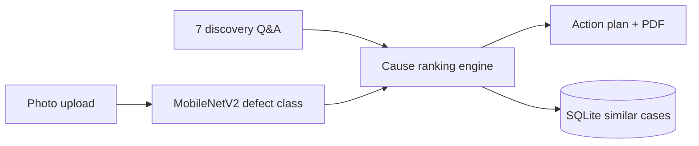

# Presentation outline (Day 19)

Use this as slide skeleton. Keep demo under 2 minutes.

## 1. Problem (30s)

- Fluid dispensing defects slow down production: under/over, missing, inconsistent, spreading, bubbles.
- New technicians lack the pattern recognition experienced engineers have.
- **We are not replacing engineers** — we accelerate preliminary troubleshooting.

## 2. Why we are different (45s)

- **Material-aware:** solder paste (T3–T6) vs UV glue vs silicone behave differently.
- **Pattern-aware:** dot vs line vs dam-and-fill rename the same defect class correctly.
- **NSW-grounded rule:** nozzle ID ≥ 5× largest powder particle ([NSW clog guide](https://nswautomation.com/NSW/prevent-solder-paste-dispensing-clog/)).
- Ranking is **deterministic rules**, not a generic chatbot hallucination.

## 3. Architecture (45s)

Three layers: Vision (Bonus 1) · Reasoning (core) · Memory + Report (Bonuses 3–4).

## 4. Dataset honesty (30s)

- 3,456 **synthetic** images with procedural defects + material textures.
- **86.4% test accuracy** on held-out synthetic set (`docs/model_metrics.md`).
- Real phone photos = validation set (`data/real/`) — expect a drop; reasoning still works from Q&A.

## 5. Live demo (90s)

1. Pick `under_dispense__solder_paste__dot.png` or upload photo.
2. Material: solder paste, Type 6, nozzle 60 µm, continuous, nozzle changed.
3. Show ranked causes: **5× rule + clog** on top with explanation.
4. Show similar cases from database.
5. Download PDF report.

Fallback: screenshots in `data/samples/` + recorded `scripts/integration_demo.py` output.

## 6. Limitations (20s)

- Vision trained on synthetic data only (so far).
- Tombstoning/bridging are downstream warnings, not vision classes.
- LLM explanation is optional narration; ranking never changes.

## 7. Team & next steps

- Person A: data/vision · B: reasoning/API · C: UI/PDF
- Next: 50–100 real phone photos, optional PCB-AoI pretrain, pattern-type second head.
